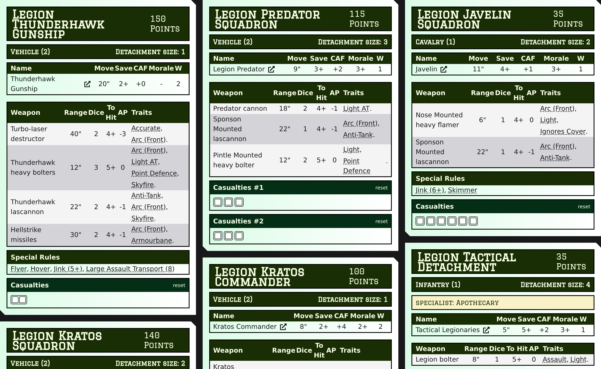

# Legion Builder — dev fork

A list builder for **Warhammer: The Horus Heresy – Legions Imperialis**, forked from
[JWTC2200/legionbuilder](https://github.com/JWTC2200/legionbuilder) and extended with an
interactive **card view**, a **force org chart**, **PDF export**, list validation, and a
Firebase‑free **local/dev mode**.



## What this fork adds

### Card list & play aid — `/lists/cards`
- **Reference cards for the units you've actually taken**, with weapon profiles **filtered
  to your selected loadouts** (unselected options hidden; a toggle can show them greyed).
- **Interactive trackers** — click wound boxes to mark **Casualties**, and diagonal‑split
  boxes for **Void Shields**. State persists per game in your browser. The two sit side by
  side so cards stay compact.
- **Toggles**: *Include unequipped*, *Show duplicates*, *Sort by name*, *Group by formation*,
  and a **Fullscreen** mode.
- **Deduplication** — identical detachments collapse into one card; different loadouts get
  `[A]/[B]` labels (on cards and the org chart). Size‑only differences don't split.
- **Clickable rules** — special rules and weapon traits link to their entry on
  [epicheresy.ru](https://epicheresy.ru).

### Force org chart
The list rendered like the rulebook's force‑organisation diagram: formation →
**Compulsory / Optional / "One of the following"** bands → role‑headed detachment boxes.

### PDF export
A print‑ready green "dataslate" PDF — one page per formation, up to ~9 cards per A4,
weapons filtered to selections, with casualty and void‑shield boxes for tracking a game on
paper.

### List validation
Soft warnings for **mandatory loadout choices not yet made** and **per‑points detachment
caps** (e.g. the Solar Auxilia *Legate Commander* — one per 1,500 points).

### Local / dev mode (no Firebase)
Set `NEXT_PUBLIC_LOCAL_MODE=true` in `.env.local` to run with no third‑party database:
auto‑login as a single `dev` user, lists stored server‑side in a JSON file and **shared**
across everyone on the network. Bundled default lists are **read‑only** (visitors can view
or duplicate, not change). Import any list by pasting its JSON.

## Running it

```bash
npm install
npm run build
npx next start -H 0.0.0.0 -p 3000      # serve the production build on the LAN
```

Rebuild (`npm run build`) after code changes, then restart the server. On Linux, a systemd
service can run `next start` on boot.

## Credits

Original application by [JWTC2200](https://github.com/JWTC2200/legionbuilder). Game rules and
unit data are © Games Workshop; this is a non‑commercial fan tool.
